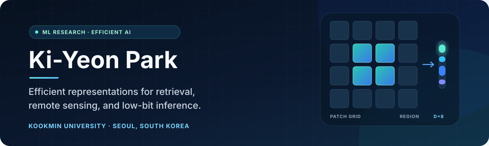

  

  
  
  
  

## Profile

I am a machine learning researcher focused on **representation learning** and
**efficient AI**. I build compact neural representations that retain useful
local and temporal structure, with applications in satellite-image retrieval
and low-bit model inference.

- **M.S. in Computer Science**, Kookmin University
- First-author research on region-aware meteorological satellite retrieval
- Research interests: image embeddings, self-supervised learning, model
  compression, and efficient inference

## Research

<table>
  <tr>
    <td width="50%" valign="top">
      <h3>Region-aware satellite retrieval</h3>
      
FIRST-AUTHOR RESEARCH

      

        A retrieval framework that encodes a full satellite image once,
        preserves a compact patch grid, and reuses arbitrary subsets for
        regional queries without crop-and-re-encode overhead.
      

      

        <code>Vision Transformer</code>
        <code>LoRA</code>
        <code>InfoNCE</code>
        <code>Spatio-temporal learning</code>
      

    </td>
    <td width="50%" valign="top">
      <h3>Compact neural representations</h3>
      
ONGOING RESEARCH

      

        Exploring low-bit post-training quantization and representation
        compression for accurate, storage-efficient, and practical neural
        inference.
      

      

        <code>2-bit PTQ</code>
        <code>Vector quantization</code>
        <code>LLM inference</code>
        <code>Model compression</code>
      

    </td>
  </tr>
</table>

## Engineering

| Project | What it demonstrates | Stack |
|---|---|---|
| [**KBO Schedule API**](https://github.com/MargielaParis/Doosan-Schedule) | Automated collection and delivery of structured game schedules through a weekly GitHub Actions workflow and GitHub Pages | Python, JSON, GitHub Actions |
| [**Front-end Systems Lab**](https://github.com/MargielaParis/skala-front) | A responsive vanilla web portal with modular weather API integration, interactive utilities, and progressive HTML/CSS/JavaScript exercises | HTML, CSS, JavaScript, Open-Meteo |

## Toolkit

**Research**

Python · PyTorch · NumPy · scikit-learn · Vision Transformers · LoRA ·
contrastive learning · retrieval evaluation

**Engineering**

Git · GitHub Actions · Linux · LaTeX · HTML · CSS · JavaScript · REST/JSON APIs

## Working principles

1. **Measure before claiming.** Keep evaluation protocols, statistical evidence,
   and claim scope aligned.
2. **Design for reuse.** Prefer representations and interfaces that avoid
   repeated computation.
3. **Document decisions.** Preserve experiment conditions, limitations, and
   reproducibility details alongside results.

  Researching efficient representations from Seoul, South Korea.

